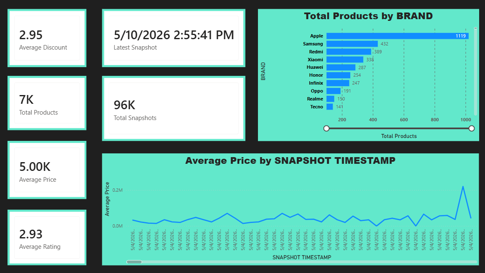
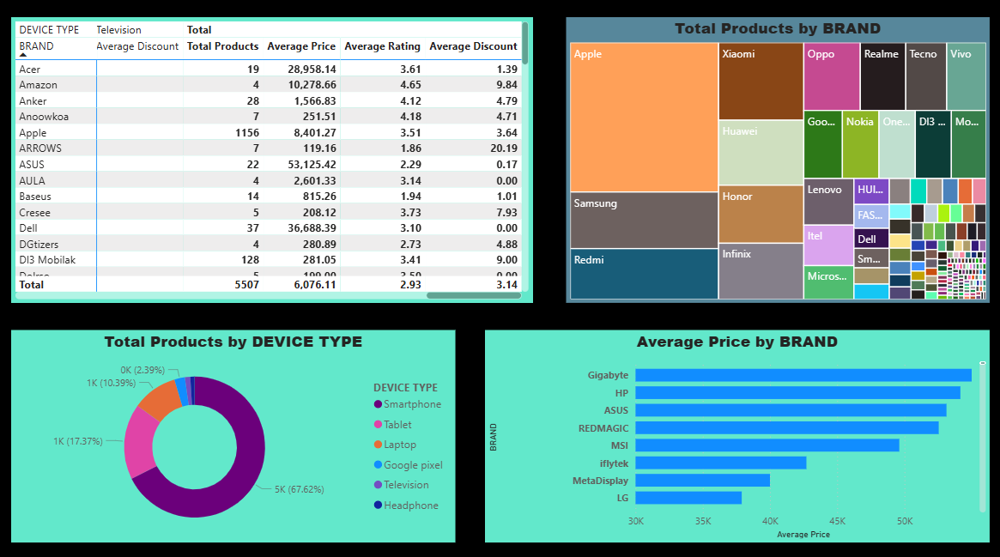
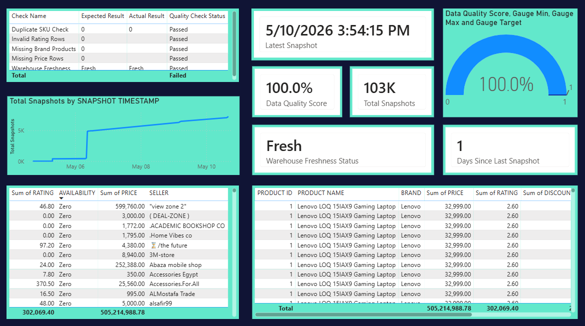
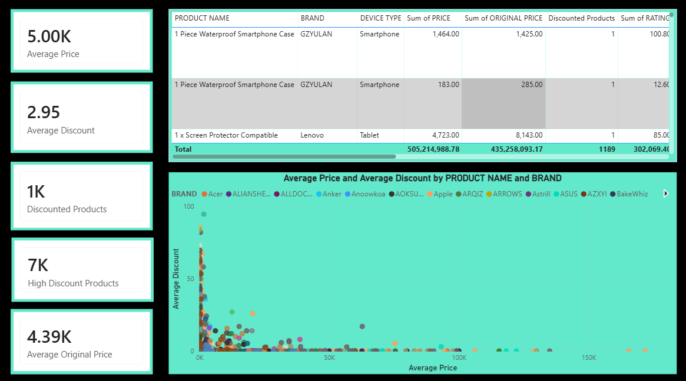
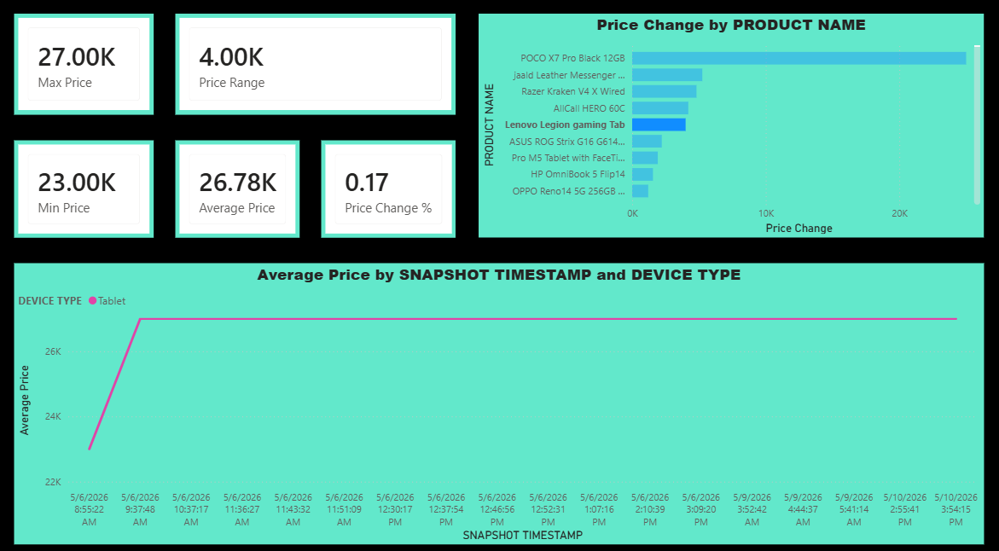
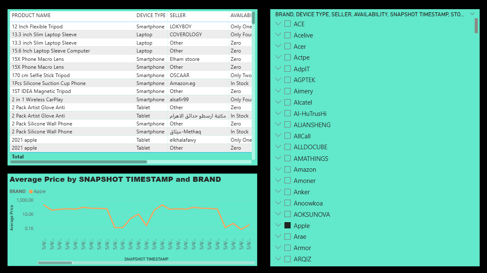

# Power BI Dashboard Guide

Use Snowflake as the primary source for the Power BI dashboard. The dashboard monitors Amazon Egypt product coverage, price movement, discounts, seller availability, data quality, and warehouse freshness.

## Current Dashboard Snapshot

The screenshots below were captured from the completed Power BI report on May 10, 2026.

Latest observed dashboard metrics:

- Total Products: about `7K`.
- Total Snapshots: about `96K` to `103K`, depending on the report page refresh time.
- Average Price: about `5.00K`.
- Average Rating: `2.93`.
- Average Discount: `2.95`.
- Data Quality Score: `100.0%`.
- Warehouse Freshness Status: `Fresh`.
- Days Since Last Snapshot: `1`.
- Latest Snapshot shown in the report: May 10, 2026.

## Connection

1. Open Power BI Desktop.
2. Select `Get Data` > `Snowflake`.
3. Enter the Snowflake account/server and warehouse from `.env`.
4. Select the configured database and schema.
5. Import or DirectQuery these tables:
   - `DIM_PRODUCTS`
   - `FACT_PRODUCT_SNAPSHOTS`

DirectQuery is preferred when the report should stay close to the live warehouse. Import mode is acceptable for portfolio demos and faster local interaction.

## Data Model

Create this relationship:

```text
DIM_PRODUCTS[PRODUCT_ID] 1 -> * FACT_PRODUCT_SNAPSHOTS[PRODUCT_ID]
```

Recommended fields:

```text
DIM_PRODUCTS[PRODUCT_ID]
DIM_PRODUCTS[PRODUCT_NAME]
DIM_PRODUCTS[BRAND]
DIM_PRODUCTS[DEVICE_TYPE]
DIM_PRODUCTS[STORAGE_CAPACITY]
DIM_PRODUCTS[RAM_MEMORY]
FACT_PRODUCT_SNAPSHOTS[PRICE]
FACT_PRODUCT_SNAPSHOTS[ORIGINAL_PRICE]
FACT_PRODUCT_SNAPSHOTS[DISCOUNT_PERCENT]
FACT_PRODUCT_SNAPSHOTS[RATING]
FACT_PRODUCT_SNAPSHOTS[AVAILABILITY]
FACT_PRODUCT_SNAPSHOTS[SELLER]
FACT_PRODUCT_SNAPSHOTS[SNAPSHOT_DATE]
FACT_PRODUCT_SNAPSHOTS[SNAPSHOT_TIMESTAMP]
```

Use `SNAPSHOT_TIMESTAMP` for time-series visuals and `PRODUCT_NAME` for user-facing product labels.

## Core Measures

```DAX
Total Products =
DISTINCTCOUNT(DIM_PRODUCTS[PRODUCT_ID])

Total Snapshots =
COUNTROWS(FACT_PRODUCT_SNAPSHOTS)

Average Price =
AVERAGE(FACT_PRODUCT_SNAPSHOTS[PRICE])

Average Rating =
AVERAGE(FACT_PRODUCT_SNAPSHOTS[RATING])

Average Discount =
AVERAGE(FACT_PRODUCT_SNAPSHOTS[DISCOUNT_PERCENT])

Latest Snapshot =
MAX(FACT_PRODUCT_SNAPSHOTS[SNAPSHOT_TIMESTAMP])

Max Price =
MAX(FACT_PRODUCT_SNAPSHOTS[PRICE])

Min Price =
MIN(FACT_PRODUCT_SNAPSHOTS[PRICE])

Price Range =
[Max Price] - [Min Price]

Price Change % =
DIVIDE([Price Range], [Min Price])

Discounted Products =
CALCULATE(
    DISTINCTCOUNT(DIM_PRODUCTS[PRODUCT_ID]),
    FACT_PRODUCT_SNAPSHOTS[DISCOUNT_PERCENT] > 0
)

High Discount Products =
CALCULATE(
    DISTINCTCOUNT(DIM_PRODUCTS[PRODUCT_ID]),
    FACT_PRODUCT_SNAPSHOTS[DISCOUNT_PERCENT] >= 20
)

Days Since Last Snapshot =
DATEDIFF([Latest Snapshot], NOW(), DAY)

Data Quality Score =
1

Warehouse Freshness Status =
IF([Days Since Last Snapshot] <= 1, "Fresh", "Stale")
```

The `Data Quality Score` can be kept as a report measure for the demo or replaced by a warehouse table if data quality results are loaded into the analytical model later.

## Dashboard Pages

### Executive Overview



Purpose: executive-level health check for product volume, pricing, ratings, discounts, latest refresh, and brand concentration.

Key visuals:

- KPI cards for average discount, total products, average price, average rating, latest snapshot, and total snapshots.
- Horizontal bar chart for total products by brand.
- Line chart for average price by snapshot timestamp.

Observed insight: Apple has the largest product coverage in the captured report, followed by Samsung, Redmi, Xiaomi, Huawei, Honor, Infinix, Oppo, Realme, and Tecno.

### Brand and Device Analysis



Purpose: compare product coverage and average pricing across brands and device types.

Key visuals:

- Matrix by device type and brand.
- Treemap for total products by brand.
- Donut chart for total products by device type.
- Bar chart for average price by brand.

Observed insight: smartphones dominate the catalog at about `67.62%` of products. Tablets are the second largest device type at about `17.37%`, followed by laptops at about `10.39%`.

### Data Quality and Freshness



Purpose: prove the warehouse is usable for analytics and not stale.

Key visuals:

- Quality check table for duplicate SKU, invalid ratings, missing brand, missing price, and warehouse freshness checks.
- Data quality score gauge.
- Latest snapshot, total snapshots, freshness status, and days-since-refresh cards.
- Snapshot growth line chart.
- Detail tables for seller, availability, price, rating, and product-level records.

Observed insight: the captured dashboard shows `100.0%` data quality score, `Fresh` warehouse status, and `1` day since the last snapshot.

### Discount Opportunity



Purpose: identify products and brands with discount signals that may represent market opportunities.

Key visuals:

- Cards for average price, average discount, discounted products, high discount products, and average original price.
- Detail table comparing price, original price, discounted products, and rating.
- Scatter plot of average price against average discount by product and brand.

Observed insight: the report shows about `1K` discounted products and about `7K` products meeting the high-discount metric definition used in the report.

### Price Trends



Purpose: track price range, price changes, and device-specific price movement across snapshots.

Key visuals:

- KPI cards for max price, min price, price range, average price, and price change percentage.
- Bar chart for price change by product name.
- Line chart for average price by snapshot timestamp and device type.

Observed insight: the captured price page highlights tablet pricing around the `26K` to `27K` average range after the May 6, 2026 snapshots.

### Product Trends



Purpose: inspect product-level records while filtering by brand, device type, seller, availability, and snapshot timestamp.

Key visuals:

- Product detail table with product name, device type, seller, and availability.
- Slicer panel for brand and other dimensions.
- Time-series chart for average price by snapshot timestamp and brand.

Observed insight: the captured page is filtered to Apple and shows large price swings across snapshots, which makes this page useful for product investigation and anomaly review.

## Recommended Report Flow

1. Start with `Executive Overview` to check core KPIs.
2. Move to `Brand and Device Analysis` to understand product mix.
3. Use `Price Trends` to investigate market movement.
4. Use `Discount Opportunity` to identify products with meaningful discounts.
5. Use `Product Trends` for row-level inspection and slicer-driven analysis.
6. Use `Data Quality and Freshness` before presenting results to confirm the pipeline is healthy.

## Refresh

After the ETL pipeline loads new snapshots into Snowflake:

1. Open Power BI Desktop.
2. Select `Refresh`.
3. Confirm `Latest Snapshot`, `Total Snapshots`, and `Warehouse Freshness Status` updated.
4. Publish to Power BI Service if the report is being shared.

For Power BI Service, configure scheduled refresh using the same Snowflake credentials and keep the refresh schedule aligned with the Airflow DAG schedule.
